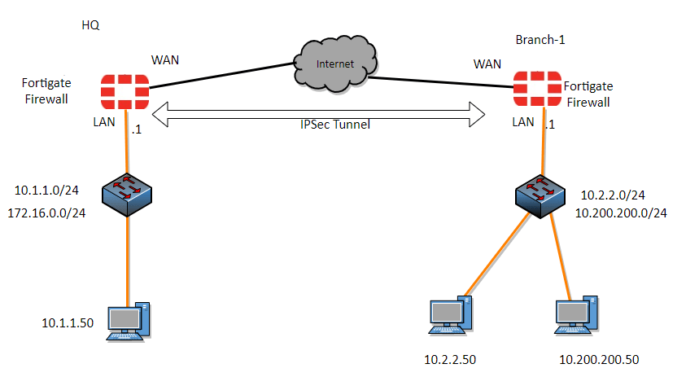
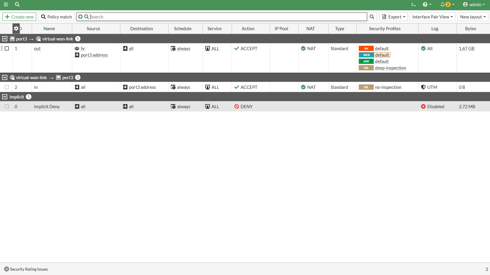
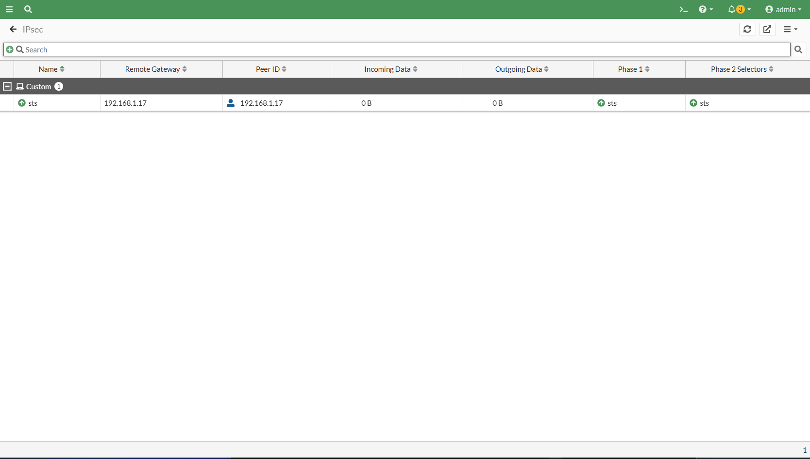
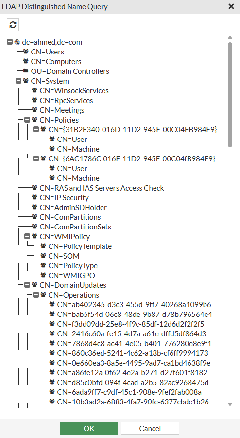
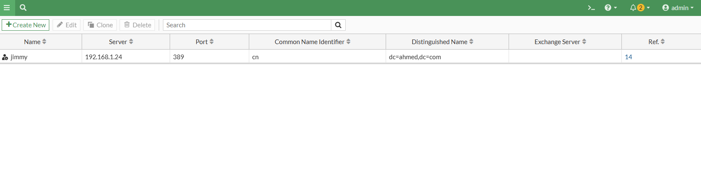
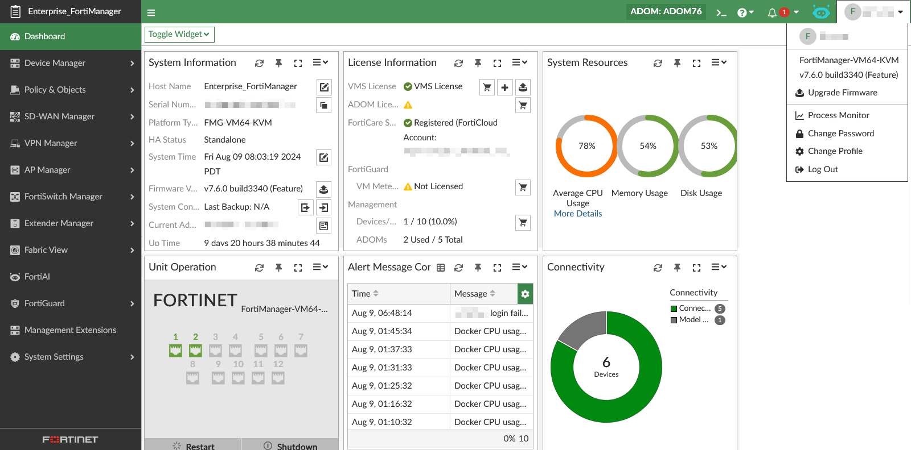

# FortiGate Configuration with Remote Users and Advanced Features

This project provides a FortiGate configuration setup that includes:

- **LDAP Integration**: Remote users and groups are fetched from an LDAP server for centralized authentication and role-based access.
- **SW-WAN (Software-Defined WAN)**: Intelligent WAN path control and link failover.
- **IPsec VPN**: Secure site-to-site or remote access VPN tunnels.
- **Security Profiles**: Deep inspection using Antivirus, Web Filtering, Application Control, and more.
## Network Topology

## policy 

## IPSEC 

## LADP1

## LADP2

## SD-WAN

## Fortimanager

## The entire project 
[Click here to vist the drive (and see the poserpoint) }(https://drive.google.com/drive/folders/1XNdkcMgr3KVCY9Od-WBLD-bDW6bzTkfp?usp=drive_link)

## Key Benefits

- Centralized **user authentication** via LDAP
- Enhanced **network reliability** with SD-WAN
- **Secure communication** using IPsec
- **Granular traffic control** with advanced security profiles

## Download

You can download the configuration files from 4shared:

🔗 [Click here to download from 4shared](https://www.4shared.com/folder/pRZYrwfV/_online.html)

## Usage

1. Import the configuration into your FortiGate device via CLI or GUI(FortiGate username:admin /password:1234).
2. Ensure you update the following:
   - LDAP server settings (IP, credentials, group filters)
   - Interface names and IP addresses
   - IPsec peer settings and phase1/phase2 configs (IPsec is applied to the 10.10.10.0/24 network on the first site, and to the 10.0.1.0/24 network on the second site )
   - SD-WAN member interfaces and rules( on port 1 and 2 , port3 it's lan 168.191.1.0/24 and condition on latency and applied security profile )
3. Apply the appropriate security profiles to your firewall policies.

## License

This project is provided for educational and reference purposes.
